<p align="center">
    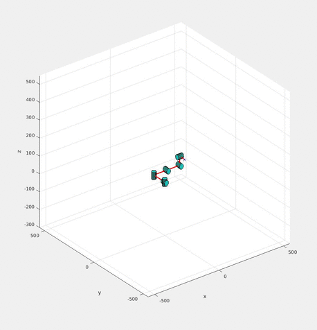
</p>


## Contents
1. [Parameter](#Parameter)
2. [Jobian](#Jacobian)
3. [Numerical](#Numerical)
4. [QuickStart](#QuickStart)


## Parameter
### Joint DOF
<p align="center">
    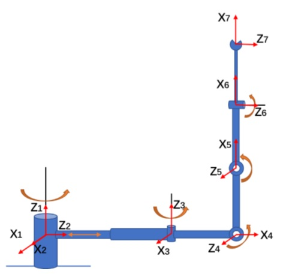
</p>

### Move
<p align="center">
    
</p>


## Jacobian

Using jacobian matrix for trajectory planning, the core is the vector product construction method.Vector product structure method will solve the Jacobi matrix is decomposed into various speed at the end of the joint contribution.The jacobian matrix is calculated as follows:
<p align="center">
    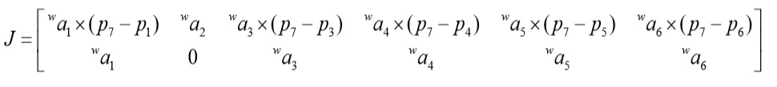
</p>
The relationship between the differential motion of terminal joint and the change of each joint is as follows.
<p align="center">
    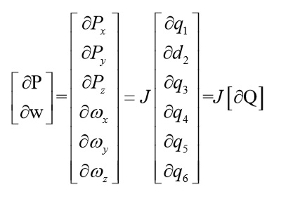
</p>


## Numerical
### Step 1
A given end target position.
<p align="center">
    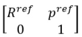
</p>
### Step 2
Given the initial joint Angle q of robot joints.
<p align="center">
    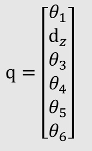
</p>
### Step 3
According to the forward kinematics, the terminal position of the initial joint Angle is calculated.

### Step 4
Calculate the error of the end position of the robot.
<p align="center">
    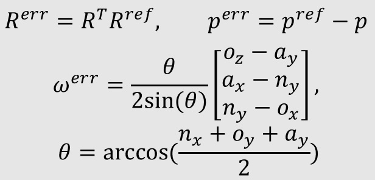
</p>
Press the joint Angle q motion manipulator, when
<p align="center">
    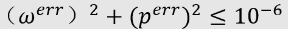
</p>
### Step 5
When the error is not enough, calculate the correct amount, modify the initial joint Angle, and repeat step 2-4 again. Where J is Jacobian referred to in the previous section.
<p align="center">
    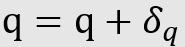
</p>
<p align="center">
    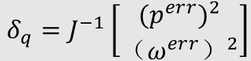
</p>
###  Command structure
<p align="center">
    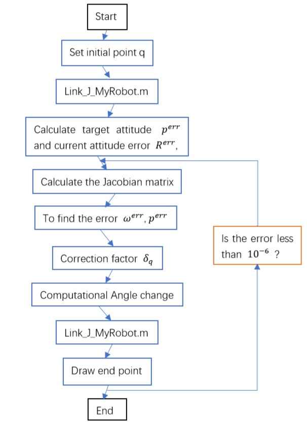
</p>

## QuickStart
###  Draw XYZ axis
```bash
Open matlab
set path under /Robot_Inverse_Kinematics_Analysis/code/  
run Numerical.m file.
```

###  Draw picture
```bash
Open matlab
set path under /Robot_Inverse_Kinematics_Analysis/code/  
run Numerical_draw_gdut.m file.
```
<p align="center">
    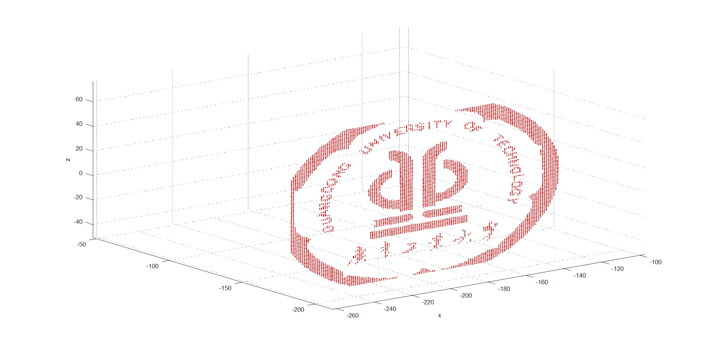
</p>
